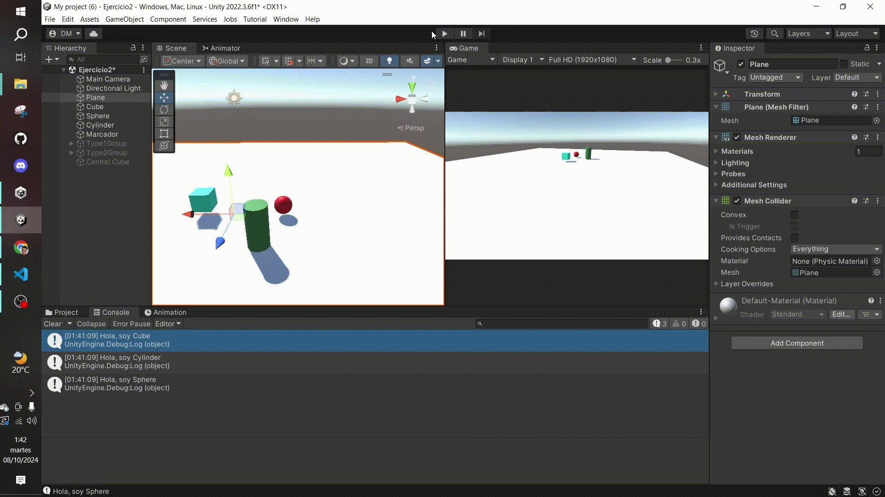
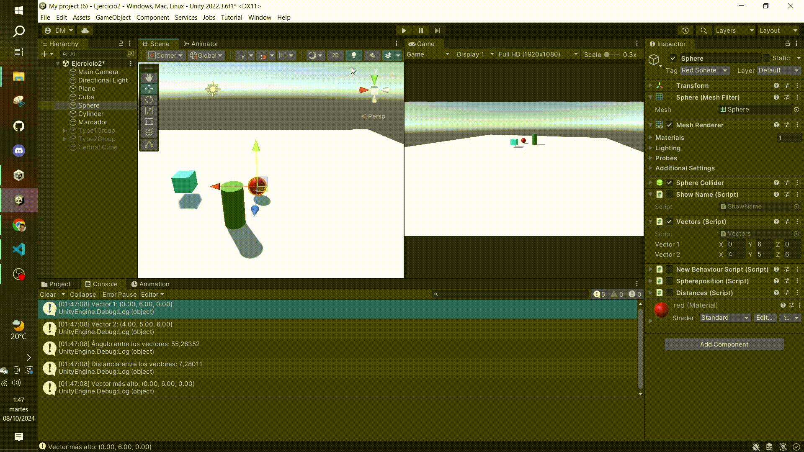
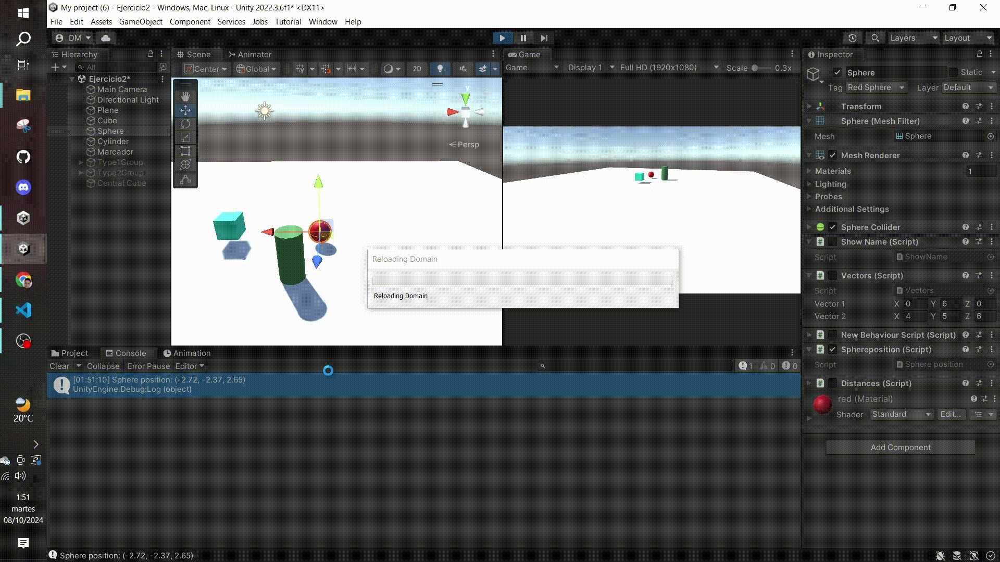
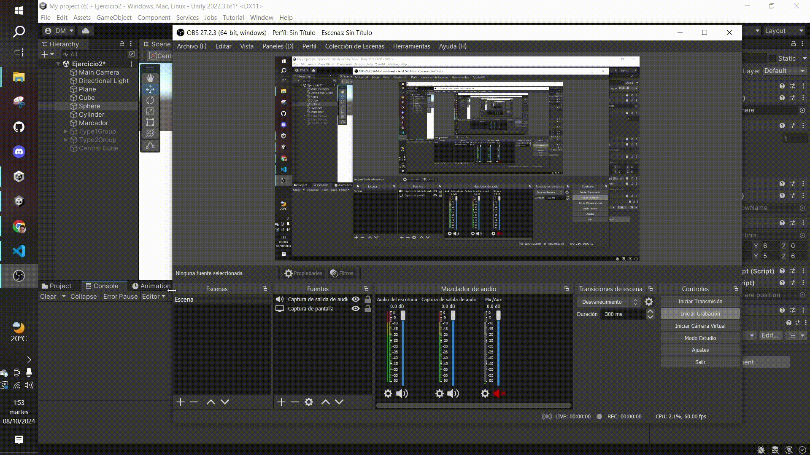
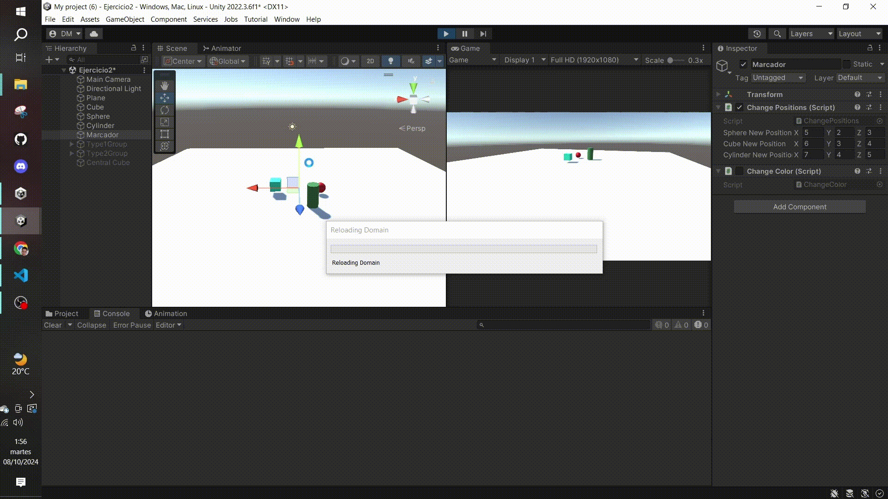
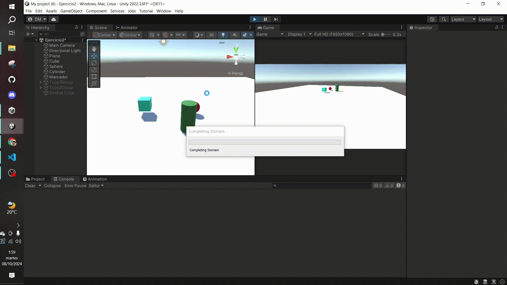
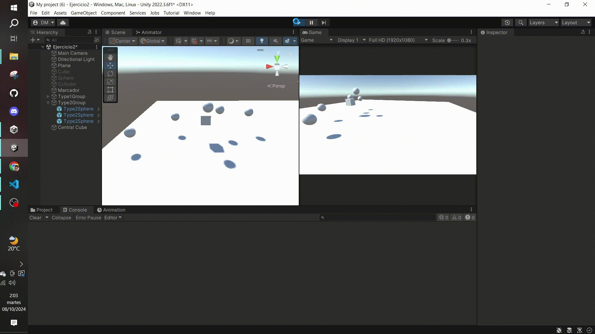

Se han usado diferentes recursos como los Tag de los objetos, así como las funciones para tratarlas (GameObject.FindObjectWithTag()), además de las figuras básicas 3D y, por supuesto, el inspector de Unity para cambiar las variables públicas. Además, se han empleado varias funciones de la clase Vector3 para resolver operaciones entre este tipo de datos.

Ejercicio 1

Ejercicio 2

Ejercicio 3

Ejercicio 4

Ejercicio 5

Ejercicio 6

Ejercicio 7

Ejercicio 8

